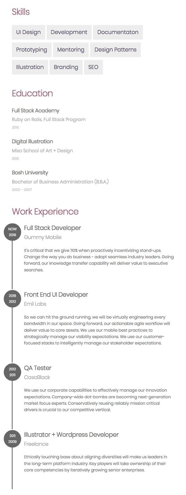

# React Portfolio - Part 2 - Props

## Context
María Santiago, a talented designer and full stack developer, has become interested in React and wants to convert her vanilla html/css/js portfolio to React components. She is unfamiliar with the technology, and she has contracted you, a specialized front-end developer, to help her with this project.

You will rebuild her portfolio project from start to finish, starting with basic JSX components and ending with stateful components that implement simple interactivity.

Here is a demo of the sequence of tasks: [Maria Portfolio](https://vanilla-to-react.surge.sh/). In order for your components to render correctly, you will need to have a similar HTML structure with similar class names. You will not need to write CSS for this project because María already has the class names and html structure.

## The Assignment
You will need to pass data into the `<App/>` component as props [React Portfolio Part 2](https://vanilla-to-react.surge.sh/portfolio-v2.html), and convert that data into JSX components. The approriate HTML structure of the JSX is shown below in the _Components in HTML_ section.

Note: you will want to use the `.map` function to convert an array of data to an array of React components

The Component structure will ultimately look like this
```
- App

  - SkillsList
    - Skill ( x 10, for each in the 'skills' array from datasource.js )

  - DegreeHistory
    - EduTitle ( x 3, for each in the 'eduList' array from datasource.js )

  - WorkHistory
    - Job ( x 4, for each in the 'jobsList' array from datasource.js )

```

### Setup Instructions

1. Project Setup from Terminal
```sh
# (1) Navigate to your assignments directory
cd ~/muktek/assignments

# (2) create the application and cd into it
create-react-app assignment--react-props-portfolio
cd assignment--react-props-portfolio

# (3) Download project files and unzip them into the src directory
curl https://raw.githubusercontent.com/muktek/assignment--react-portfolio-02-props/master/project-files.zip > project-files.zip

unzip project-files.zip -d ./src/

# (4) return to project root directory and start the react task runner
cd ..
npm start
```

2. Additional Configuration:
  - For fonts + icons:
    - The project uses Poppins font family (from Google Fonts) and [ionicons](http://ionicons.com/) for icon fonts.
    - You will need to link to the files from a CDN in the `<head>` of the `index.html` inside the `public/` directory.
    - in `public/index.html`
      ```html
      <head>
        ...
        <title>Portfolio</title>
        <link href="https://fonts.googleapis.com/css?family=Poppins:200,300,400,500,600,700,800" rel="stylesheet">
        <link rel="stylesheet" href="https://cdnjs.cloudflare.com/ajax/libs/ionicons/2.0.1/css/ionicons.min.css">
      </head>
      ```
  - For project styles:  
    - You will need to import the project styles (`css/styles.css`) into the `index.js` file (you will use these styles in place of `index.css`).
    - You will need to remove the styles imported from `App.css"` in `App.js`.
  - For data:
    - the data is distributed through the project-files in the `data/` directory in a file called `datasource.js`
    - In order to complete the assignment, you will need to import each array in `datasource.js` in your `App.js` like so (with the correct filepath):
    ```js
      import {skills, eduList, jobsList} from «...path/to/datasourcefile.js...»
    ```

### Expected Result


